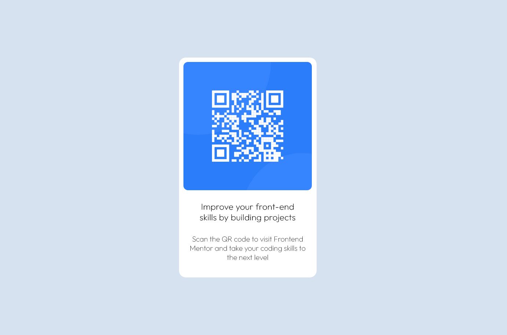

# Frontend Mentor - QR code component solution

This is the solution for the [QR code component challenge on Frontend Mentor](https://www.frontendmentor.io/challenges/qr-code-component-iux_sIO_H).

## Table of contents

  - [Overview](#overview)
    - [Screenshot](#screenshot)
    - [Links](#links)
  - [My process](#my-process)
    - [Built with](#built-with)
    - [What I learned](#what-i-learned)
    - [Continued development](#continued-development)
  - [Author](#author)
  - [Acknowledgments](#acknowledgments)

## Overview

  This is my very first project on github. I tried to build a QR code that direct you to the official Frontend Mentor site. Feel free to check out!

### Screenshot

### Links

- Solution URL: [The Project](https://github.com/Feysel-6/QR-Code-Component)
- Live Site URL: [The Site](https://feysel-6.github.io/QR-Code-Component/)

## My Process

### Built With

- Semantic HTML5 markup
- CSS custom properties
- Flexbox

### What I learned

As my first foray into the world of web development, this project has been an invaluable learning experience. The opportunity to hone my GitHub skills has been a major highlight for me, and I've thoroughly enjoyed the process. While this is my first project using HTML, I felt confident in my abilities and it didn't significantly impact my overall programming experience.

### Continued development

This project has solidified my commitment to prioritize responsive design in my future web development endeavors. I'm particularly passionate about further refining my Flexbox skills, and I'm excited to apply my different ways to tackle the same problems with fresh perspectives in my upcoming projects.

## Author

- Frontend Mentor - [@Feysel-6](https://www.frontendmentor.io/profile/Feysel-6)
- Twitter - [@_f_e_y_e](https://www.twitter.com/_f_e_y_e)

## Acknowledgments

Special thanks to [@whiHak](https://github.com/whiHak) for their valuable contributions and assistance with this project. Their support and insights have been truly appreciated.
